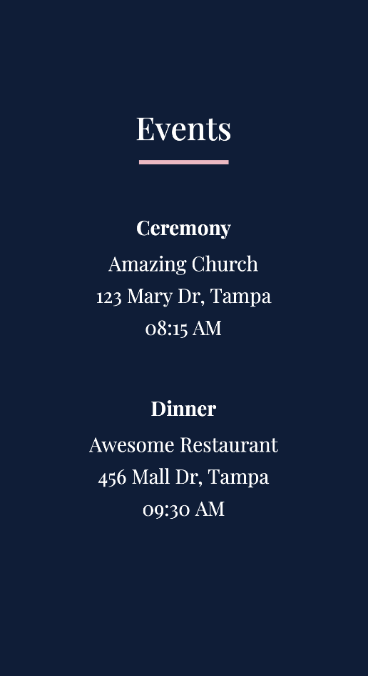
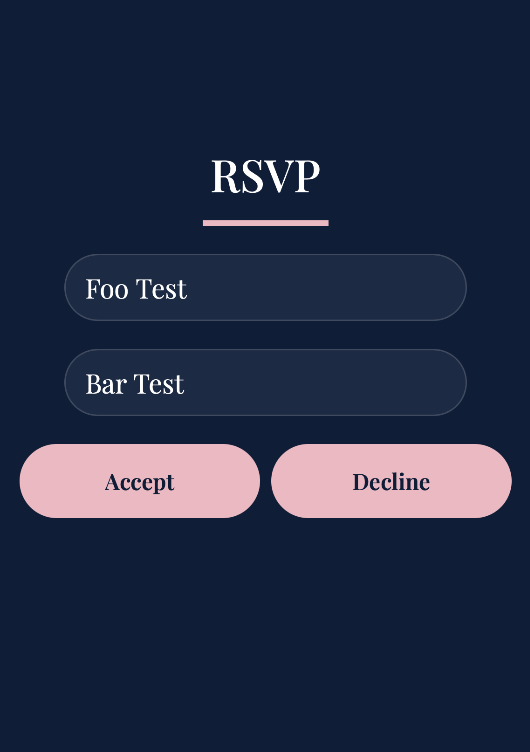
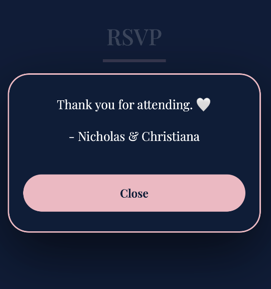
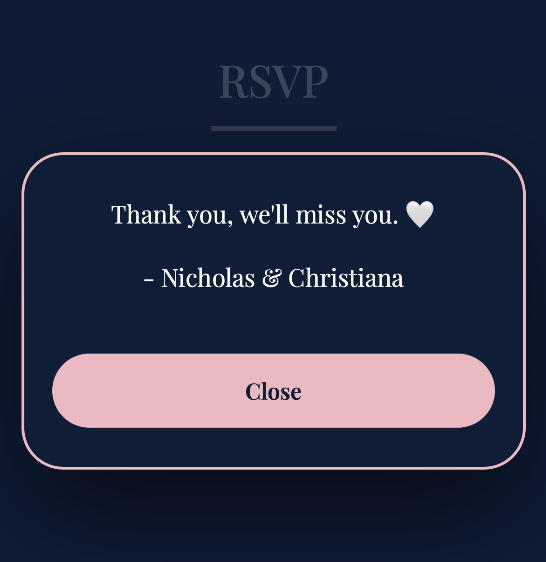
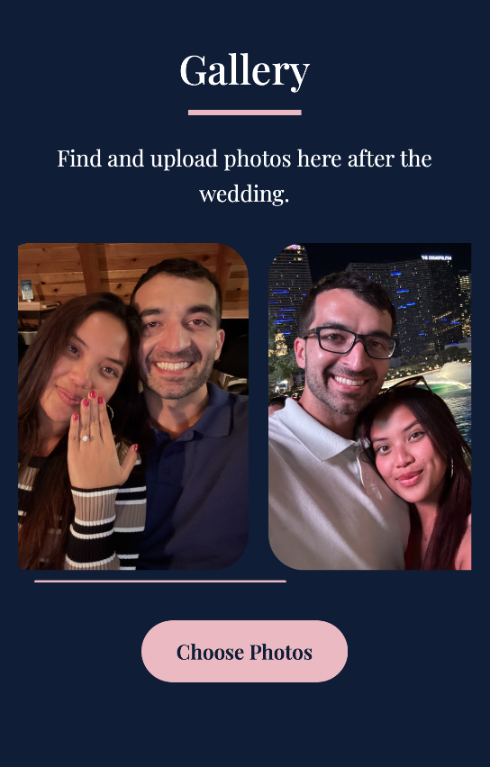
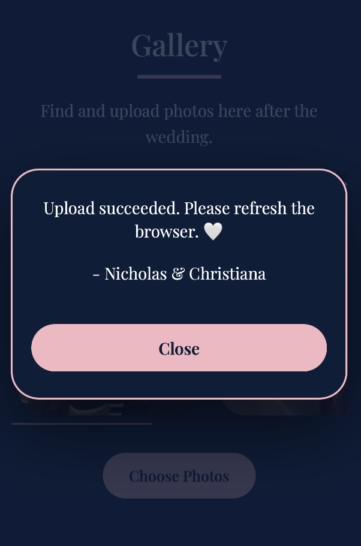
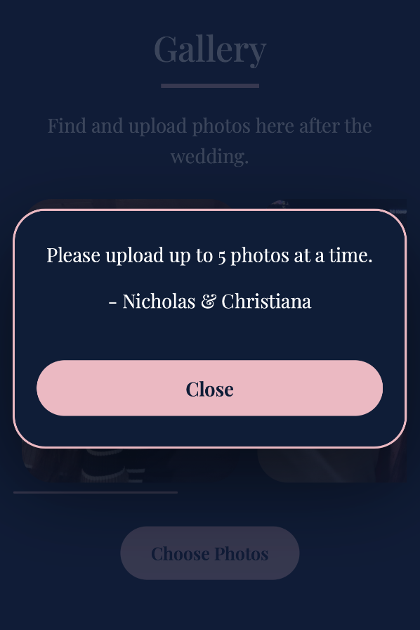
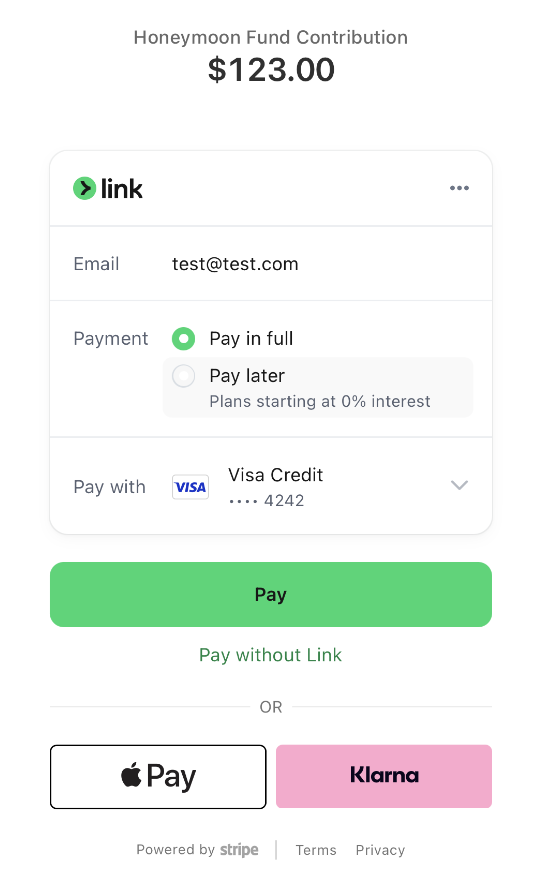
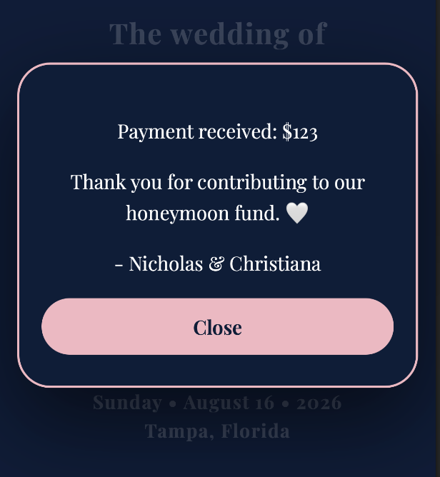

# 💍 Wedding Website

A full-stack wedding invitation web app built for my own wedding. 🤍

Guests look up their invitation by token, submit their RSVP,  upload photos to a shared gallery, and contribute to a honeymoon fund. A password-protected admin panel lets the couple manage the guest list, and view RSVPs. 

## ✨ Features

- 🔍 **Wedding lookup** by personalized token
- 💌 **RSVP submission** with plus-one support
- 💛 **Honeymoon fund** via Stripe embedded checkout
- 🖼️ **Photo gallery** — guests upload photos via s3
- 🔐 **Admin panel** with JWT authentication

---

## 🛠️ Tech Stack

**Frontend**
- React 19 
- Stripe.js

**Backend**
- Java 21
- Spring Boot 3.3
- MySQL database
- JWT authentication
- Stripe Java SDK
- AWS S3

**Testing**
- JUnit 5 

**Infrastructure**
- Maven
- AWS EC2 instance 

---

## 📁 Project Structure

```
invites/
├── assets/          # Design assets (mockups, screenshots)
├── client/          # React frontend
├── server/          # Spring Boot backend
│   └── src/
│       ├── main/
│       │   ├── java/com/wedding/
│       │   │   ├── controller/  # REST endpoints
│       │   │   ├── domain/      # Business logic & services
│       │   │   ├── data/        # JPA repositories
│       │   │   ├── model/       # JPA entities
│       │   │   └── dto/         # Request / response records
│       │   └── resources/
│       │       ├── sql/         # Schema and seed scripts
│       │       └── application.properties.example
│       └── test/
├── build.sh         # Builds client + server into a deployable zip
└── upgrade.sh       # SCP zip to EC2 and restart the app
```

---

## 🗺️ Example Outputs

### 🤍 Landing Page & Events

<table align="center"><tr>
  <td></td>
  <td></td>
</tr></table>

### 💌 RSVP & Responses

<table align="center"><tr>
  <td></td>
  <td></td>
  <td></td>
</tr></table>

### 🖼️ Gallery & Responses

<table align="center"><tr>
  <td></td>
  <td></td>
  <td></td>
</tr></table>

### 💛 Honeymoon Fund & Stripe Checkout

<table align="center"><tr>
  <td></td>
  <td></td>
  <td></td>
</tr></table>

---

## 🚀 Local Setup

### 1. Database

```bash
mysql -u root -p < server/src/main/resources/sql/wedding-db-schema-prod.sql
# for running tests locally:
mysql -u root -p < server/src/main/resources/sql/wedding-db-schema-test.sql
```

### 2. Backend configuration

```bash
cp server/src/main/resources/application.properties.example \
   server/src/main/resources/application.properties
```

| Property | Description |
|----------|-------------|
| `spring.datasource.url` | JDBC URL, e.g. `jdbc:mysql://localhost:3306/wedding_db_prod` |
| `spring.datasource.username` | MySQL username |
| `spring.datasource.password` | MySQL password |
| `spring.datasource.driver-class-name` | `com.mysql.cj.jdbc.Driver` |
| `stripe.secret.key` | Stripe secret key (`sk_live_...` or `sk_test_...`) |
| `aws.region` | AWS region of your S3 bucket, e.g. `us-east-1` |
| `aws.bucket` | S3 bucket name |
| `admin.password` | Password for the admin panel |
| `admin.jwt.secret` | Random string, **minimum 32 characters** |
| `admin.jwt.expiry-hours` | JWT token lifetime in hours, e.g. `8` |

### 3. Run the backend

```bash
cd server
mvn spring-boot:run
```

### 4. Run the frontend

```bash
cd client
npm install
npm start
```

---

## 🧪 Running Tests

```bash
cd server
mvn test
```

---

## 📦 Deployment

### Build

```bash
./build.sh
```

Produces a timestamped zip under `dist/` containing the server jar, compiled React assets, SQL scripts, and a `run.sh` launcher.

### Deploy to EC2

```bash
./upgrade.sh dist/wedding-<timestamp>.zip ec2-user@<host> /path/to/key.pem
```

The script:
1. SCPs the zip to the remote machine
2. Stops the running server and MySQL Docker container
3. Unzips and starts the new version via `run.sh`
4. Verifies the server and database are running
5. Cleans up old deployment directories

The server expects an `application.properties` file placed next to `app.jar` on the remote machine (copy from `application.properties.example`).

---

## 📡 API Overview

| Method | Endpoint | Description |
|--------|----------|-------------|
| `GET` | `/api/info` | Wedding details (names, date, city) |
| `GET` | `/api/rsvp?token=` | Look up RSVP by token |
| `POST` | `/api/rsvp` | Submit RSVP response |
| `POST` | `/api/honeymoon-fund` | Create Stripe checkout session |
| `GET` | `/api/checkout-session/{id}` | Retrieve Stripe session amount |
| `GET` | `/api/photo-gallery` | List approved photos (pre-signed S3 URLs) |
| `POST` | `/api/photos/upload` | Get a pre-signed S3 PUT URL |
| `POST` | `/api/photos/save` | Save uploaded photo (pending approval) |
| `POST` | `/api/admin/login` | Admin login — returns JWT |
| `GET` | `/api/admin/guests` | List all guests (JWT required) |
| `GET` | `/api/admin/rsvps` | List all RSVPs (JWT required) |
